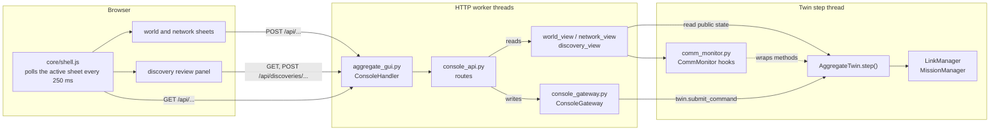

# Aggregate twin console 
### *(Mostly made with Claude AI)

A browser console for the aggregate twin. It shows the fleet on a map, the communication network between the aggregate, its instances and their agents, and lets an operator dispatch missions, pair agents with instances and review agent discoveries.

It is a plain Python HTTP server (standard library only, plus `omegaconf` for discovery layers) serving a vanilla JavaScript front end. There is no build step: the browser loads ES modules straight from `static/`.

```python
from aggregate_twin.gui.aggregate_gui import start_gui

start_gui(twin, host="0.0.0.0", port=8082)   # returns the server; runs in a daemon thread
```

Open `http://<host>:8082`.

---

## What the operator sees

**World sheet.** The map of the world with obstacles, agents drawn as their real footprint, mission goals and routes. On the left is the mission dispatch form; clicking the map sets a goal or adds a waypoint. On the right are live lists of the fleet, missions and obstacles; selecting a row highlights it on the map and shows its route.

**Network sheet.** A graph with the aggregate in the center.

- Right half: linked pairs, aggregate → instance → agent, coloured by link health, with animated packets on live links.
- Left half: the unlinked pool, mirrored around the aggregate. Unlinked agents on the far left, unlinked instances between them and the aggregate. A ring around every pool node drains as it approaches eviction. Handshakes in flight are drawn as moving dashed links.

Beside the graph are the pairing controls (mode picker and a manual pairing form), message counters and the protocol log. Under it are two tables: the link history of every agent since start-up, and the current unlinked pool.

**Discovery review.** A side panel opened from the header. Agents that announced themselves while auto-complete is off wait here. Each one gets a form with one entry per configuration field, where the operator picks which layer a value comes from or writes a custom value. Fields are checked as the operator types and again on the server.

**Header.** Twin name, sim time, lifecycle (idle, binding, live), the auto-complete switch and the review button, which turns amber with a count when agents are waiting.

---

## Architecture



### Threading model

Three kinds of code touch the twin, and each has one job.

| Where | What it does | Rule |
|---|---|---|
| Step thread | `AggregateTwin.step()` and everything it calls | The only code that changes twin or manager state. |
| HTTP worker threads | Views build JSON snapshots; the gateway validates writes | Views only read, and iterate over copies (`list(...)`). The gateway never changes state itself: it hands a closure to `twin.submit_command()`, which the step thread runs at the start of its next tick. |
| Step thread, via hooks | `CommMonitor` counts and logs traffic | Hooks wrap the twin's own methods, so they run on whichever thread called them. They only record; a failing hook is logged, never raised. |

This is why most writes answer `202 Accepted`: the request was valid and has been queued. The effect shows up in the next snapshot, normally within one tick.

The one deliberate exception is discovery review. Resolving, rejecting and auto-completing remove the entry from `twin.discoveries_gui` on the HTTP thread as well, so the next poll no longer offers it and a double click cannot submit it twice. A dict `pop` is atomic, and the step thread only ever adds to or pops from that dict.

If a twin has no `submit_command`, the gateway calls the twin directly and logs a warning once. That works, but it can race `step()`.

### Request cycle

1. `core/shell.js` fetches the active sheet's endpoint (`/api/world` or `/api/network`) every 250 ms, with at most one request in flight.
2. Every snapshot carries two shared blocks, whichever sheet asked:
   - `twin`: header data such as name, sim time, lifecycle and counts.
   - `review`: auto-complete state and the queue of discoveries waiting for review.
3. The shell renders the header, passes the snapshot to every `onSnapshot` listener (the review panel and the auto-complete switches), then to the active sheet's `render`.
4. Operator actions `POST` to the API. On success the module calls `refresh()` for an immediate poll instead of waiting for the next tick.

Transport errors ("cannot reach") and render errors ("console render error") are reported separately in the banner, so a JavaScript error is never mistaken for a dead server.

---

## Folder layout

```
gui/
├── aggregate_gui.py          start_gui(), HTTP handler, static files
├── console_api.py            every route, one thin function each
├── http_router.py            path router, Request, ApiError / NotFound / Conflict
├── console_gateway.py        every write: validate, then queue onto the step thread
├── comm_monitor.py           read-only traffic instrumentation
├── view_helpers.py           shared converters and the header block
├── world_view.py             /api/world snapshot
├── network_view.py           /api/network snapshot: pairs, pool, pairing
├── discovery_view.py         review queue and one agent's form
├── discovery_resolver.py     config layers → form, answers → discovery fields
├── discovery_validation.py   field rules shared with the browser
└── static/
    ├── index.html            markup only
    ├── css/
    │   ├── console.css       layout, header switch, review button, toast, tabs
    │   ├── network.css       graph overlays, pairing panel, pool table
    │   └── review.css        review panel, queue, field editors
    └── js/
        ├── main.js           entry point: registers sheets, boots the shell
        ├── core/             shell, API client, DOM and canvas helpers
        ├── world/            world sheet
        ├── network/          network sheet
        └── discovery/        review panel, validation, auto-complete
```

`theme.css` is not in this folder. It lives in `core_msgs/gui/` and is shared with the instance viewer, so it is served from there and left unchanged. Everything here only reads its tokens (`--signal`, `--warn`, `--panel`, ...) and adds console-specific styles on top.

---

## Backend components

### `aggregate_gui.py`
Entry point. `start_gui()` builds one `CommMonitor`, one `ConsoleGateway` and a `Console` context holding both plus the twin, then starts a `ThreadingHTTPServer` in a daemon thread.

`ConsoleHandler` reads the JSON body of every POST and matches the path against the router. If nothing matches, it serves a static file: first from `static/`, then from `core_msgs/gui/`. Paths are normalised and must stay inside those folders, and only known file types are served.

Errors are mapped once, here:

| Raised | Status |
|---|---|
| `ApiError` and subclasses | its own status, body `{"error", "fields"?}` |
| `ValueError`, `KeyError`, `TypeError` | 400 |
| anything else | 500, logged with a traceback |

### `http_router.py`
`Router` maps `(method, pattern)` to a handler. Patterns take `{name}` placeholders that match one path segment and arrive URL-decoded in `request.params`. The module also defines `Request` and the operator-facing errors: `ApiError` (400 by default, optional per-field messages), `NotFound` (404) and `Conflict` (409).

### `console_api.py`
One function per route, registered on the module-level `api` router. Handlers receive `(console, request)` and return either a payload (200) or `(payload, status)`. They contain no logic: reads call a view, writes call the gateway.

### `console_gateway.py`
Every write the console can make. Each method checks the request against the current state first, so the operator gets a precise error (for example "inst_4 is busy with another handshake."). Only then does it queue the change with `twin.submit_command`.

| Method | Effect |
|---|---|
| `dispatch_mission(spec)` | Builds a `Mission` with `mission_from_spec` and queues `twin.add_mission` |
| `cancel_mission(id)` | Queues `twin.cancel_mission` |
| `replan()` | Queues `twin.trigger_global_reassignment` |
| `set_linking_mode(value)` | Queues `twin.set_linking_mode`; refuses modes that need instance discovery when it is off |
| `link_pair(agent, instance)` | Queues `twin.gui_assign_instance`; requires Manual mode, a reviewed agent not in a handshake, and a free pooled instance |
| `release(agent)` | Queues `twin.release_agent` |
| `resolve_discovery(agent, choices)` | Resolves and validates the answers, builds an `AgentDiscoveryMessage`, queues `twin.gui_trigger_discovery` |
| `reject_discovery(agent)` | Queues `twin.gui_reject_discovery`, which drops the agent from the pool and unsubscribes it |
| `set_autocomplete(enabled)` | Sets `twin.autocomplete`; turning it on also completes every waiting discovery with `merge_layers` |

### `comm_monitor.py`
Instrumentation only. It wraps these methods on the live twin and link manager:

- **Outbound:** `_flush`, which reads both managers' outboxes just before they are sent.
- **Inbound:** `_handle_discovery`, `_handle_instantiate_reply`, `_handle_activate_reply`, `_handle_mission_reply`, `_handle_twin_state`, `_handle_obstacle`, `_handle_heartbeat`.
- **Lifecycle:** `on_agent_incomplete`, `on_agent_discovered`, `gui_confirm_agent`, `gui_reject_agent`, `on_link`, `on_release`.

A method it cannot find is listed once in a warning at start-up, so a rename in the twin shows up immediately.

It keeps:
- `peers`: one `Peer` per agent, with its phase (discovered, review, requested, linked, released, rejected) and a `Channel` per message stream (count, rate in Hz, age of last message).
- `heartbeats`: one `Channel` per node, used for the heartbeat rate in the pool table.
- `events` and `telemetry_events`: two capped logs (400 entries each), kept apart so high-rate telemetry never pushes handshake entries out.
- `msgs_in` and `msgs_out` totals.

### `view_helpers.py`
Converters shared by the views:
- `xy` accepts `State2D`, tuples or numpy columns; `velocity` does the same for velocities.
- `route_points` flattens A* output and thins it to 160 points.
- `obstacle` and `shape_of` build what the map draws.
- `enum_name` and `enum_value` read enums safely.
- `header()` builds the `twin` block every snapshot carries.

### `world_view.py`
`world_state(twin, monitor)`: world bounds, every agent (with footprint and the route of its active mission), static and reported obstacles, all missions, and the mission type and posture options for the dispatch form.

### `network_view.py`
`network_state(twin, monitor, gateway)` builds:

- `graph.pairs`: one entry per linked agent, with a health state derived from the time since its last twin state (`live`, `stale`, `silent`, or `releasing` while its handshake is being cancelled).
- `graph.pool.agents` and `graph.pool.instances`: every unlinked node, with its state (see [Pool states](#pairing-modes-and-pool-states)), the instances it is engaged with, heartbeat rate, age and time until eviction.
- `pairing`: current mode, which modes are available, whether instance discovery is on, the pool timeout, and the agents and instances that can be paired by hand right now.
- `rows`, `counters`, `events`, `telemetry_events` for the tables, counter strip and log.

### `discovery_view.py`
`review_state(twin)` is the `review` block on every snapshot: the auto-complete flag and a one-line summary per waiting agent. `discovery_form(twin, agent)` returns one agent's full form. `pending_layers` raises `NotFound` when the agent is no longer waiting.

### `discovery_resolver.py`
Turns the config layers that `check_discovery()` stored into a form, and the operator's answers back into `AgentDiscoveryMessage` fields.

- **Layers,** highest priority first: `reported` (what the agent said), `agent` (config for this agent by name), `type` (default for its agent type), `kind` (default for UGV or UAV).
- **Identity fields** (`name`, `kind`, `interface_name`, `namespace`, `timestamp`) are never asked. They are always copied from the report.
- **Every other dataclass field becomes one question,** including fields that no layer can fill; those must be written by hand.
- **Value type** comes from the dataclass annotation when it names one kind of value (`Optional[float]` → `number`), otherwise from the first candidate's value, otherwise `json`.
- **Only custom answers carry a value from the browser.** For every other answer the server looks the value up again in the layers, so a client cannot submit a value it was not offered.

`apply_resolution(layers, choices)` returns the final fields or raises `DiscoveryValidationError` with one message per failing field.

### `discovery_validation.py`
The field rules, written once in Python:

| Rule | Checks |
|---|---|
| `Required` | Not `None` and not blank text |
| `OfType(type)` | `string`, `number`, `boolean`, `object`, `list` or `json` (anything) |
| `Pattern(regex)` | Whole-string regex match on text |
| `Length(min, max)` | Length of text or a list |
| `Range(min, max)` | Numeric bounds |
| `OneOf(options)` | Membership in a fixed set |

Every field gets `Required` (unless its schema says `required=False`), then `OfType`, then whatever `FIELD_SCHEMAS` adds for that field. A blank value is only checked by `Required`, so optional fields may stay empty. Each rule's `describe()` travels with the form, so the browser runs the same checks; see [Adding a validation rule](#adding-a-validation-rule).

---

## HTTP API

All bodies are JSON. Writes answer `202` once the change is queued.

| Method | Path | Body | Success | Errors |
|---|---|---|---|---|
| GET | `/healthz` | | status and header block | |
| GET | `/api/world` | | world snapshot | |
| GET | `/api/network` | | network snapshot | |
| GET | `/api/discoveries/{agent}` | | review form | 404 not waiting |
| POST | `/api/missions` | mission spec | `{mission_id}` | 400 invalid spec |
| POST | `/api/missions/cancel` | `{mission_id}` | | 404 |
| POST | `/api/replan` | | | 400 no reassignment |
| POST | `/api/pairing/mode` | `{mode}`: `pooled`, `first_free`, `gui` or `auction` | `{mode}` | 400 unknown, 409 needs instance discovery |
| POST | `/api/pairing/link` | `{agent, instance}` | | 404 not pooled, 409 wrong mode, unreviewed or busy |
| POST | `/api/release` | `{agent}` | | 404 not linked |
| POST | `/api/autocomplete` | `{enabled}` | `{autocomplete, completed}` | |
| POST | `/api/discoveries/{agent}/resolve` | `{fields: {name: answer}}` | | 404, 422 with `fields` |
| POST | `/api/discoveries/{agent}/reject` | | | 404 |

An answer is `{"source": "reported" \| "agent" \| "type" \| "kind"}` or `{"source": "custom", "value": <any JSON>}`. A field left out of `fields` keeps its preselected source.

A failed resolve looks like this:

```json
{
  "error": "2 fields need attention.",
  "fields": {
    "max_speed": "Expected a number.",
    "sensors": "Choose a source or write a custom value."
  }
}
```

### Review form payload

```json
{
  "id": "rover_2",
  "agent": {"id": "rover_2", "kind": "ugv", "agent_type": "husky"},
  "sources": {"reported": {"label": "Reported", "hint": "What rover_2 reported about itself"}, "...": {}},
  "fields": [
    {
      "name": "max_speed",
      "type": "number",
      "selected": "agent",
      "conflict": true,
      "candidates": [{"source": "agent", "value": 1.4}, {"source": "type", "value": 1.0}],
      "rules": [
        {"rule": "required", "message": "Choose a source or write a custom value."},
        {"rule": "type", "type": "number", "message": "Expected a number."}
      ]
    }
  ]
}
```

---

## Front-end components

All modules are native ES modules. Every module exports a `create...` or `register...` function and keeps its state in a closure, so nothing leaks onto `window`.

### `js/core/`

| Module | Role |
|---|---|
| `shell.js` | Sheet registry, polling loop, banner, tab switching. A sheet registers `{endpoint, render, activate?, resize?}`. Other modules subscribe with `onSnapshot(fn)` and force a poll with `refresh()`. |
| `header.js` | Renders the `twin` block into the header and footer. |
| `api.js` | `get` and `post`. Failures throw `ApiError` with `status` and per-field `fields`. |
| `dom.js` | `$`, `$$`, `setText`, and the `html` template tag. Interpolated values are escaped unless they are themselves `html` markup, so rendering operator or agent strings is safe by default. `render(el, markup)` accepts markup or arrays of it. |
| `format.js` | `num`, `pct`, `secs`, `clock`, `plural`. |
| `canvas.js` | `surface()` for a device-pixel-ratio aware 2D context, `token()` to read `theme.css` colours, `withAlpha()`, `reducedMotion()`. |
| `toast.js` | Short confirmations of operator actions. |

### `js/world/`

| Module | Role |
|---|---|
| `world-sheet.js` | Registers the sheet and owns its shared state (snapshot, selected agent and mission, picked goal). |
| `world-canvas.js` | Projection from world to screen, grid, obstacles, footprints, goals and routes; pointer readout and goal picking. |
| `world-panels.js` | Fleet, mission and obstacle lists; selection and mission cancel. |
| `dispatch-form.js` | Mission form: shows the inputs that match the mission type, fills goals from map clicks, dispatch and replan. |

### `js/network/`

| Module | Role |
|---|---|
| `network-sheet.js` | Registers the sheet, wires the operator actions (link, set mode, open review) and runs the animation loop only while the sheet is visible. |
| `network-graph.js` | Layout and drawing of pairs, pool and edges; hover readout; click-to-pair. |
| `pairing-panel.js` | Mode picker and the manual pairing form. Select options are rebuilt only when the set of choices changes, so polling never resets an open dropdown. |
| `network-tables.js` | Counter strip, link history table, unlinked pool table (with Review and Pair buttons) and the protocol log. |
| `pairing-copy.js` | The words shown for modes and pool states, shared by the graph, panel and table so all three always agree. |

**Graph layout.** The aggregate is at the center. Pool agents sit at 20% and pool instances at 60% of the left half; linked instances sit at 40% and linked agents at 80% of the right half. Each column spreads its nodes evenly from top to bottom.

**Edge kinds:**
- `instantiate` and `telemetry` for linked pairs, with animated packets when live.
- `heartbeat`: faint dotted line from the aggregate to a pool node.
- `offer`: moving dashed line from an instance to an agent it is being offered.
- `choice`: pink dotted line for the operator's pick, also used for the "link?" preview while pairing.

**Pairing on the graph** (Manual mode only): click a waiting agent or a free instance to arm it. Everything that cannot be paired with it dims and the valid partners pulse. Click a partner to link them; press Esc or click empty space to cancel. Clicking an agent that needs review opens its review instead.

### `js/discovery/`

| Module | Role |
|---|---|
| `review-panel.js` | The review panel: open and close, the queue on the left, loading and caching each agent's form, approve and reject, moving on to the next agent. Exports `openReview(agent?)`, which the network sheet uses. |
| `review-form.js` | One agent's form: fields grouped into "Needs a value" and "Confirm the source", progress bar, footer status, Approve, and Reject (click twice to confirm). Maps server field errors back onto fields. |
| `field-editor.js` | One field: source chips, preview of the chosen value, an editor matching the value type (text, number, true/false, JSON), and its own status. |
| `validation.js` | Browser half of `discovery_validation.py`: `RULES`, `validate()`, and `parseCustom()` / `toRaw()` for turning typed text into values and back. |
| `autocomplete.js` | Keeps every `[data-autocomplete]` switch (header and panel) in sync and toggles the setting. |

**How a field decides what to show.** A field is `ready`, `pending` or `error`.

- An error is shown once the operator has touched the field, after an approve attempt, when the chosen source itself holds an invalid value, or when the server rejected the field.
- Until then an unfilled field only says "Needs a value", so a fresh form is not covered in red.
- Server errors stay until that field is edited.

**Drafts outlive forms.** Answers are stored per agent and per field, outside the form. The operator can switch between waiting agents and come back to find everything as they left it.

---

## Pairing modes and pool states

| Mode (`LinkingMode`) | Label | Behaviour | Needs instance discovery |
|---|---|---|---|
| `pooled` | Broadcast | Each agent is offered to every instance; the first to accept gets it | no |
| `first_free` | First free | Each agent goes to the free instance that has waited longest | yes |
| `gui` | Manual | Agents wait until the operator pairs them | yes |
| `auction` | Auction | Free instances bid; the lightest load wins | yes |

With instance discovery off, instances never announce themselves, so the pool has no instances to pick from. `LinkManager` then allows only `pooled`; the panel greys out the other modes and explains why.

**Pool agent states:**

| State | Meaning | Colour |
|---|---|---|
| `review` | Known, but its discovery waits for the operator | amber |
| `waiting` | Complete, no instance asked yet | grey, dashed |
| `chosen` | The operator picked an instance that is still busy | pink |
| `requesting` | Offered to every instance at once (Broadcast) | cyan, pulsing |
| `offered` | Offered to one instance | cyan |
| `bidding` | Instances are bidding for it (Auction) | cyan |
| `releasing` | Its handshake is being cancelled | dim |

**Pool instance states:** `free` (grey, dashed) and `engaged` (cyan, in a handshake).

**Link history phases:** `discovered`, `review`, `requested`, `linked`, `released`, `rejected`.

---

## Extending

### Adding a validation rule

Use an existing rule for a field by adding a schema in `discovery_validation.py`:

```python
FIELD_SCHEMAS: dict[str, FieldSchema] = {
    "frame_id": FieldSchema(rules=(
        Pattern(regex=r"[a-z0-9_]+(/[a-z0-9_]+)*", message="Use a ROS frame like rover_1/base_link."),
    )),
    "radius": FieldSchema(rules=(Range(min=0.05, max=2.0, message="Between 0.05 and 2 m."),)),
    "sensors": FieldSchema(required=False),
}
```

A new kind of check needs a rule class on the server:

```python
@dataclass(frozen=True)
class UniqueItems(Rule):
    name: ClassVar[str] = "unique_items"
    message: str = "Remove the duplicates."

    def accepts(self, value):
        return not isinstance(value, list) or len(value) == len({repr(v) for v in value})
```

and, for live feedback, the same name in `static/js/discovery/validation.js`:

```js
export const RULES = {
  // ...
  unique_items: value => !Array.isArray(value) || new Set(value.map(v => JSON.stringify(v))).size === value.length,
};
```

The browser skips rule names it does not know, so the JavaScript half is optional; the server check always runs. Regexes run in both Python and JavaScript, so keep to the syntax both share.

### Adding an endpoint

1. Put the logic in `ConsoleGateway` (a write) or a view module (a read). Raise `ApiError`, `NotFound` or `Conflict` with a sentence the operator can act on.
2. Add a thin route in `console_api.py`:

   ```python
   @api.post("/api/agents/{agent}/pause")
   def pause_agent(console, request):
       console.gateway.pause(request.params["agent"])
       return {"ok": True}, ACCEPTED
   ```

3. Call it from the front end with `post()` from `core/api.js`, show the outcome with `toast()`, and call `refresh()`.

### Adding a sheet

1. Add a `<main id="yoursheet">` and a tab `<button class="tab" data-sheet="yoursheet">` to `index.html`.
2. Create `js/yoursheet/yoursheet-sheet.js` exporting `registerYoursheetSheet()`, which calls `registerSheet('yoursheet', {endpoint, render, activate, resize})`.
3. Call it from `main.js`.
4. Serve the endpoint from a new view module. Include `header(twin, monitor)` as `twin` and `review_state(twin)` as `review`, so the header and review badge stay live on the new sheet.

### Adding a pool state

Emit it from `_pool_agents` or `_pool_instances` in `network_view.py`. Then give it a colour in `STATE_TOKEN` in `network-graph.js` and its words in `POOL_STATUS` in `pairing-copy.js`.

---

## Conventions

- **Markup** is built with the `html` tag from `core/dom.js` and never by concatenating strings, so values are always escaped.
- **Colours** come from `theme.css` tokens, never hard-coded hex in JavaScript (`token('--warn')`).
- **Operator-facing text** is short, plain and active ("Review rover_2's discovery before pairing it."), and errors say what to do next.
- **Motion** only shows live activity: packets, offers, pulses. The animation loop runs only while the network sheet is visible and stops when the browser asks for reduced motion.
- **Keyboard:**
  - Esc closes the review panel or cancels a pairing on the graph.
  - Arrow keys move between source chips and between pairing modes.
  - Tab stays inside the review panel while it is open.

## Requirements on the twin

The console reads these from the twin. Keep them if the twin is refactored; the monitor warns at start-up about any hooked method it cannot find.

- **Attributes:** `name`, `namespace`, `loop_freq`, `dt`, `_sim_step`, `autocomplete`, `instance_discovery`, `transport`, `fleet`, `obstacles`, `world_config`, `missions`, `active_missions`, `missions_in_flight`, `unlinked_agents`, `discoveries_gui`, `link_manager`, `mission_manager`.
- **Methods:** `submit_command`, `add_mission`, `cancel_mission`, `trigger_global_reassignment`, `set_linking_mode`, `gui_assign_instance`, `release_agent`, `gui_trigger_discovery`, `gui_reject_discovery`.
- **On `link_manager`:** `linking_mode`, `mode_available`, `instance_discovery`, `pool_timeout`, `unlinked_instances`, `instance_choice`, `handshakes`, `elections`, `free_instances`, `engaged_instances`, `subjects_on`, `releasing`, `in_flight`.
